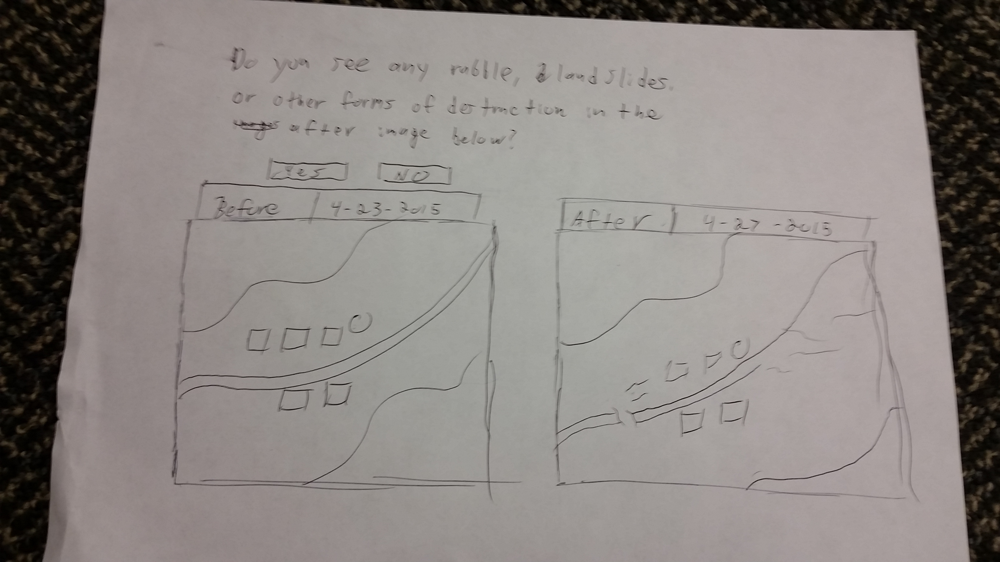

# Earthquake-hackathon
Last hackathon of UCDD2
## Links to the new articles as the source of inspirations for your app

* [Nepal earthquake: Rescuers struggle to reach remote villages](http://www.ft.com/cms/s/0/838455e4-ec0e-11e4-b428-00144feab7de.html#slide0)
* [Nepal earthquake: The race is on to help thousands trapped under rubble around Kathmandu, while remote villages face a long wait for help](http://www.independent.co.uk/news/world/asia/nepal-earthquake-the-race-is-on-to-help-thousands-trapped-under-rubble-around-kathmandu-while-remote-villages-face-a-long-wait-for-help-10204416.html)

## A design sketch of the main screens of your app

## A writeup of the use cases supported by the app'
* Tag an image for potential signs of destruction
* Get all or some of locations flagged (could be automatically sent to appropriate resources)

## An architecture diagram highlighting the major technical components
## An implementation plan broken down into milestones
1. Capture and store original images from satellite 
2. Update and store new images
3. Create comparative UI
4. Create back end to store responses
5. Analyze and aggregate data accordingly 
6. Perform correct response in cases of data finding event
